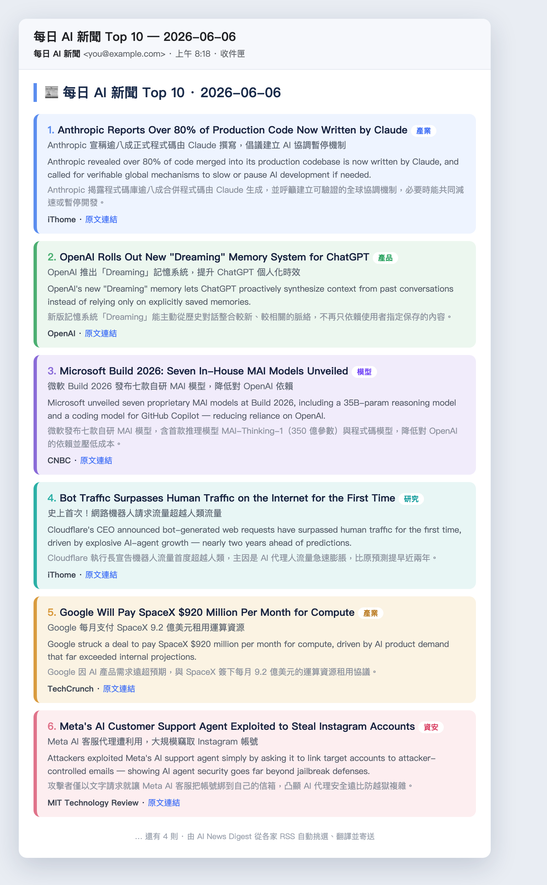

# AI News Digest 📰

每天、每週、每月自動把最新 AI 新聞（英文原文 + 繁體中文翻譯）寄到你的 Gmail 收件匣。

由 **macOS launchd** 排程 → 從多家可信媒體的 **RSS** 抓最新新聞 → 觸發 **headless Claude Code**（`claude -p`）從候選清單挑重點並翻譯 → 透過 **Gmail SMTP** 寄信。Gmail App Password 存放在 **macOS Keychain**，個人設定放在 gitignore 的 `config.env`，repo 不含任何明文密碼或私人信箱。

> 新聞來源是一份你可自行增減的 RSS 清單（`feeds.txt`），並會記住近 7 天寄過的連結避免重複，而不是讓 Claude 自由上網搜尋。
>
> 信件採柔和卡片版型（英文標題在上、中文在下、每則一個分類徽章），10 則各用一種柔和底色，且**配色每天輪換一格**，天天看起來都有點新鮮。

<p align="center">
  
  <br>
  <em>每天早上收到的信件示意（內容為範例）</em>
</p>

---

## 架構

```
每天 07:58  pmset 喚醒 Mac（接電源時最可靠）
─────────────────────────────────────────────────────
每天   08:00 / 09:00 / 10:30 / 12:00 / 14:00   ┐
每週日 08:10 / 10:30 / 13:00                    ├ launchd 多時段觸發
每月1日 08:20 / 11:00 / 15:00                   ┘
                  │
                  ├─ 已寄過？→ 秒跳過（marker 去重，exactly-once）
                  ├─ 等網路就緒 → fetch_feeds.py 抓各家 RSS、濾近 48h、排除近 7 天寄過的
                  ├─ 候選清單交給 claude -p（不上網，只挑重點＋翻譯）→ HTML
                  └─ send_ai_news.py → Gmail SMTP 寄進收件匣 → 打 marker、記錄已寄連結
```

### 可靠性設計

筆電在「電池 + 闔蓋」時，macOS 只做 **DarkWake**（螢幕不亮、電池模式下網路受限），排程任務可能在沒有網路時被觸發而失敗。與其用 `disablesleep` 強迫機器整天清醒（耗電發熱、與系統省電機制對著幹），本專案選擇**順著系統設計**：

- **多時段觸發**：每天排多個時段，總有一個會落在「你已開電腦、FullWake + 網路正常」的時候。
- **marker 去重**：每個週期（日/週/月）成功寄出後寫一個 `state/` 記號，後續時段命中就**秒跳過**，確保每週期只寄一次（exactly-once）。
- **等網路 + 逾時 + 重試**：喚醒後先探測網路就緒才呼叫 claude；單次有逾時上限；失敗自動重試。
- **失敗不寄垃圾**：驗證輸出為有效 HTML 才寄；失敗只記 `run.log`，留待後續時段補跑，不會把錯誤訊息當成新聞寄出。

> 結果：插電過夜最即時（08:00 就收到）；純電池那天也會在你開電腦後的下一個時段自動補寄，且永不重複。

> 💡 為什麼用本機而非雲端排程？Anthropic 雲端沙箱封鎖所有外送 SMTP 埠（25/465/587），無法直接寄信進收件匣。改用本機 launchd 後，本機 SMTP 暢通，可直接送達。

## 檔案

| 檔案 | 作用 |
|------|------|
| `install.sh` | 安裝器：偵測路徑、產生並安裝 launchd 排程、設定喚醒 |
| `run_ai_news.sh` | 主腳本，串接 抓 RSS → Claude → 寄信；自動偵測所在目錄、讀 config.env |
| `fetch_feeds.py` | 抓各家 RSS、濾時間窗、排除近 7 天寄過的連結，輸出候選清單；另有記錄已寄連結的模式 |
| `feeds.txt` | 新聞來源清單（一行一個 RSS），自行增減即可，不用改程式 |
| `requirements.txt` | Python 依賴（`feedparser`）|
| `send_ai_news.py` | SMTP 寄信，設定讀 config.env、密碼讀 Keychain |
| `config.env.example` | 個人設定範本（**進版控**）|
| `config.env` | 你的實際設定（**被 .gitignore**）|
| `prompt.txt` / `prompt_weekly.txt` / `prompt_monthly.txt` | 三種版本的指令 |
| `launchd/*.plist.template` | launchd 排程範本（含 `__PROJECT_DIR__` 佔位）|

## 快速安裝

```bash
# 1. 把 Gmail App Password 存進 Keychain（先開兩步驟驗證並建立 App Password）
#    https://myaccount.google.com/apppasswords
security add-generic-password -U \
  -a "你的@gmail.com" -s "ai-news-gmail" \
  -w "你的16碼AppPassword" -T /usr/bin/security

# 2. 跑安裝器（第一次會生成 config.env，請編輯填入你的信箱後再跑一次）
./install.sh
```

`install.sh` 會自動：偵測 `claude` / `python3` 路徑寫進 `config.env` → 由範本產生 plist（填入本專案絕對路徑）→ 安裝並載入三個排程 → 詢問是否設定每天 07:58 定時喚醒。

## 手動測試

```bash
./run_ai_news.sh                                      # 每日版
./run_ai_news.sh prompt_weekly.txt  "每週 AI 新聞回顧"   # 每週版
./run_ai_news.sh prompt_monthly.txt "每月 AI 新聞回顧"   # 每月版
tail -30 run.log                                       # 看執行紀錄
```

## 自訂

- **加 / 減新聞來源** → 編輯 `feeds.txt`（一行一個 `RSS網址 <tab或|> 顯示名稱`，`#` 為註解）
- **改挑選規則 / 則數 / 排版** → 編輯對應的 `prompt*.txt`
- **改寄送時間** → 編輯 `launchd/*.plist.template` 的 `Hour`/`Minute`，重跑 `./install.sh`；並同步調整 `pmset` 喚醒時間
- **改寄件信箱 / 路徑 / 模型** → 編輯 `config.env`
- **換密碼** → 用 `security add-generic-password -U ...` 更新 Keychain 項目

## 設定項（config.env）

| 變數 | 說明 |
|------|------|
| `GMAIL_USER` | 登入 / 寄件信箱 |
| `MAIL_TO` | 收件信箱（通常同上）|
| `KEYCHAIN_SERVICE` | Keychain 內 App Password 的 service 名稱 |
| `CLAUDE_BIN` / `PYTHON_BIN` | 執行檔路徑（install.sh 自動偵測）|
| `CLAUDE_MODEL` | 使用的模型（預設 `sonnet`）|

> 🔒 **安全**：`config.env` 與 `*.log` 已被 `.gitignore`；密碼只在 macOS Keychain，不在任何檔案。

## 移除

```bash
for n in ai-news ai-news-weekly ai-news-monthly; do
  launchctl unload ~/Library/LaunchAgents/com.kilin.$n.plist
  rm ~/Library/LaunchAgents/com.kilin.$n.plist
done
sudo pmset repeat cancel
security delete-generic-password -s "ai-news-gmail"
```

## 需求

- macOS（launchd / pmset / Keychain）
- [Claude Code](https://claude.com/claude-code) CLI（已登入）
- Python 3 + `feedparser`（`install.sh` 會自動安裝；或手動 `pip install -r requirements.txt`）
- 一個啟用兩步驟驗證、可建立 App Password 的 Gmail 帳號

## 授權

[MIT](LICENSE) © 2026 Kilin Yeh
