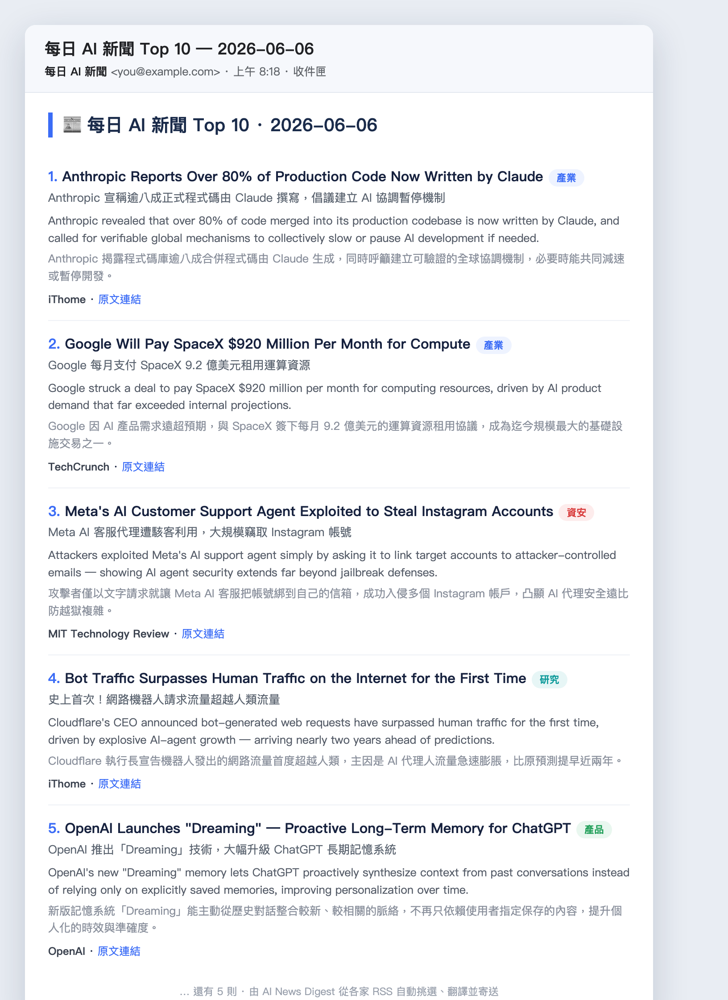

# AI News Digest 📰

每天、每週、每月自動把最新 AI 新聞（英文原文 + 繁體中文翻譯）寄到你的 Gmail 收件匣。

**本機**由 macOS launchd 排程 → 從多家可信媒體的 **RSS** 抓最新新聞 → 觸發 **headless Claude Code**（`claude -p`）從候選清單挑重點並翻譯 → 稿存進 state 分支。**雲端**由 Cloudflare Worker 準點觸發 GitHub Actions，透過 **Gmail SMTP** 寄出。Gmail App Password 存放在 **macOS Keychain**（雲端則用 repo secret），個人設定放在 gitignore 的 `config.env`，repo 不含任何明文密碼或私人信箱。

> 新聞來源是一份你可自行增減的 RSS 清單（`feeds.txt`），並會記住近 7 天寄過的連結避免重複，而不是讓 Claude 自由上網搜尋。
>
> 信件採柔和卡片版型（英文標題在上、中文在下、每則一個分類徽章），10 則各用一種柔和底色，且**配色每天輪換一格**，天天看起來都有點新鮮。

<p align="center">
  
  <br>
  <em>每天下午收到的信件示意（內容為範例）</em>
</p>

---

## 架構

**三種信走同一條路**：本機只負責「產稿」，寄出全部交給雲端（跟筆電是否開機、有沒有網路脫鉤）。
本機不再直接寄任何信——寄信要成功得筆電醒著又有網路，那正是最不可靠的環節。

新聞主力來源（iThome 等）約中午才大批上架，故備稿排在中午：等池子長滿再產，較能湊足 10 則。

```
本機（launchd 備稿）                        雲端
───────────────────────────                ─────────────────────────────
每天 12:00 / 13:00 各跑一次 run_slot.sh     Cloudflare Worker digest-cron（準點鬧鐘）
  依序問三種週期「今天該備嗎」：              台北 14:00（slot=last）
    daily   每天                              │ GitHub API workflow_dispatch（立即執行，不排隊）
    weekly  週六（週日可補備）                 ▼
    monthly 當月倒數第二天（最後一天可補）   daily-send.yml（GitHub Actions）
  ├─ 非備稿日 → 秒退（純日期判斷，不碰網路）  ├─ 今天該寄哪些？（daily / 週日加 weekly /
  ├─ 等網路就緒（最多 120 秒）                │   當月最後一天加 monthly）
  ├─ 同步 state 分支（pull 失敗即放棄）       ├─ 已寄過？→ 秒跳過（marker 去重）
  ├─ 已寄過 / 已備妥？→ 秒跳過                ├─ 本週期的稿在？→ 寄出
  ├─ 抓 RSS → claude 產稿 → HTML             ├─ 缺稿且本機沒警示過 → 寄體檢警示信
  └─ 寫 outbox → push 上 state 分支 ──────→  └─ 打 marker、記已寄連結 → 推回 state 分支
  └─ 13:00 那班失敗 → 本機當下直接寄警示信
```

**備稿排在寄出的前一天**（每日信除外）：週報週六備、週日寄；月報當月倒數第二天備、最後一天寄。
這樣備稿失敗時還有一整天可以手動補救，而不是當場就沒有。

信寄在週期的最後一天，內容才涵蓋完整週期，marker 也才對得上內容：7/31 寄的月報涵蓋 7 月，
marker 就是 `monthly-2026-07`。

跨班次狀態放在獨立 **state 分支**（本機用旁邊的 worktree `../ai-news-state` 操作），
main 分支永遠不被每日紀錄洗版：

- `state/daily-YYYY-MM-DD`、`weekly-YYYY-Www`、`monthly-YYYY-MM` — 本週期寄過了（所有班次先查它去重）
- `state/outbox-{daily,weekly,monthly}.json` — 有稿待寄。**存的是「週期代號」不是日期**：
  備稿日與寄出日刻意落在同一週期內，所以前一天備的稿隔天仍有效；上一個週期的舊稿代號對不上，一律拒寄
- `state/alert-<kind>-YYYY-MM-DD` — 這個週期今天警示過了（本機寄成才寫，雲端看到就不重複寄）
- `state/attempts-YYYY-MM-DD.log` — **只有出事那天才會出現**：當天各時段的 RESULT 摘要，供警示信引用
- `state/seen_urls.json` — 已寄連結（跨週期去重）

### 可靠性設計

筆電在「電池 + 闔蓋」時，macOS 只做 **DarkWake**（螢幕不亮、電池模式下網路受限），排程任務可能在沒有網路時被觸發而失敗。與其用 `disablesleep` 強迫機器整天清醒（耗電發熱、與系統省電機制對著幹），本專案選擇**順著系統設計**：

- **先等網路再動作**：每個時段一開場就探測網路（最多等 **7.5 分鐘**），通了才碰 git / RSS / claude。這一步必須排在 state 同步之前，否則 DarkWake 班次會在 `git pull` 就被 DNS 打死，等網路的機制根本跑不到——詳見 [docs/decisions/2026-07-26-schedule-alignment-and-alerts.md](docs/decisions/2026-07-26-schedule-alignment-and-alerts.md)。等這麼久是為了手機熱點：Mac 要先用藍牙把 iPhone 叫醒、iPhone 才開始廣播、再關聯、再 DHCP，整串常要好幾分鐘。
- **不只在固定時刻跑，網路一通就跑**：`launchd` 除了 12:00 / 13:00 兩個固定班，還監看網路設定（`WatchPaths`），接上 WiFi 或熱點就再觸發一次。固定班會漏——只要機器醒著上網的那段時間剛好落在兩班之間，兩班就都撲空。觸發時間窗與 marker 去重擋住重複做工，窗外觸發連 log 都不寫（只覆寫 `.last-trigger.log`），免得雜訊淹掉 `RESULT`。
- **喚醒時間必須貼著備稿時段**：`pmset repeat` 全機只能設**一組**重複喚醒（12:00），那一次 FullWake 是整天唯一保證有網路的時刻。備稿第一班就排 12:00 貼在它後面；13:00 是補救班，靠「你人在電腦前」的機會。**改備稿時間務必同步改 `install.sh` 的 `WAKE_TIME`**：喚醒沒貼著備稿時段的話，那些班拿到的是 DarkWake，連 DNS 都解不到。
- **marker 去重**：每個週期成功寄出後寫一個 `state/` 記號，後續時段命中就**秒跳過**，確保每週期只寄一次（exactly-once）。
- **等網路 + 逾時 + 重試**：先探測網路就緒才呼叫 claude；單次有逾時上限；失敗自動重試。
- **失敗不寄垃圾**：驗證輸出為有效 HTML 才寄；失敗只記 `run.log`，留待後續時段補跑，不會把錯誤訊息當成新聞寄出。
- **每個時段都留一行 `RESULT`**：`RESULT daily FAIL 網路未就緒`。沒有這行就代表那個時段**根本沒被觸發**（機器沒醒），跟「跑了但失敗」是兩回事——混在一起就無從除錯。
- **一個排程依序跑三種週期**，不是三個排程各排同一個整點：同時觸發會搶 `../ai-news-state` 的 git `index.lock`，先到的成功、後到的莫名其妙失敗。

### 出事的時候你什麼時候會知道

| 失敗情況 | 警示信時間 | 誰寄的 |
|---|---|---|
| 有網路，但 claude 失敗 / RSS 空 / 寫檔失敗 | **13:00 當下** | 本機直寄，最即時 |
| 沒網路、筆電整天沒開 | **14:00** | 雲端體檢信（本機寄不出任何東西，只有雲端發得出） |

兩層互補，用 `alert-<kind>-YYYY-MM-DD` marker 去重，不會收到兩封。本機寄信失敗就不寫 marker，雲端自然接手——順序不可顛倒，先寫 marker 再寄信會變成「沒信也沒人知道」。

警示信裡直接附上當天各時段的 `RESULT`，不用再開電腦翻 log。**如果連 `attempts` 檔都沒有**，那本身就是答案：本機一次都沒能連上 GitHub，代表筆電整天沒有真正喚醒。

> 結果：只要 12:00 或 13:00 有一班備稿成功，14:00 就收到信；否則 13:00（有網路）或 14:00（沒網路）收到警示信。你只要記兩個時間：**14:00 收信、13~14:00 沒信看警示**。

> 💡 為什麼觸發用 Cloudflare 而非 GitHub schedule？實測 GitHub schedule 延遲 1~4 小時、台北 08:00 前後的班次會整班靜默消失。Cloudflare Workers Cron 準點開槍、數十秒內 GitHub run 就建立。
> 💡 為什麼產稿仍在本機？產稿靠 claude CLI（本機已登入、不另花 API 費用）；寄信才是怕筆電沒開的環節，所以只把「寄出」搬上雲端。

## 檔案

| 檔案 | 作用 |
|------|------|
| `install.sh` | 安裝器：偵測路徑、產生並安裝 launchd 排程、設定喚醒（`WAKE_TIME` 要對齊第一個備稿時段）|
| `run_slot.sh` | **一個備稿時段做的事**：依序把 daily / weekly / monthly 都問一遍。launchd 只掛這一支 |
| `run_ai_news.sh` | 單一週期的備稿流程：等網路 → 同步 state → 抓 RSS → Claude → 寫 outbox；失敗時負責警示 |
| `fetch_feeds.py` | 抓各家 RSS、濾時間窗、排除近 7 天寄過的連結，輸出候選清單；另有記錄已寄連結的模式 |
| `feeds.txt` | 新聞來源清單（一行一個 RSS），自行增減即可，不用改程式 |
| `requirements.txt` | Python 依賴（`feedparser`）|
| `send_ai_news.py` | SMTP 寄信，設定讀 config.env、密碼讀環境變數（雲端）或 Keychain（本機）|
| `outbox.py` | outbox 存取 + **時程的單一真相**：哪天該備、哪天該寄、週期代號怎麼算，都在這裡 |
| `tests/test_outbox.py` | 週期判斷的測試（月底、閏年、跨月跨週界）——這塊錯了信會整批不寄或寄錯月份 |
| `.github/workflows/daily-send.yml` | 雲端寄信與缺稿體檢（由 Cloudflare Worker digest-cron 準點觸發）|
| `config.env.example` | 個人設定範本（**進版控**）|
| `config.env` | 你的實際設定（**被 .gitignore**）|
| `prompt.txt` / `prompt_weekly.txt` / `prompt_monthly.txt` | 三種版本的指令 |
| `launchd/*.plist.template` | launchd 排程範本（含 `__PROJECT_DIR__` 佔位）|

## 快速安裝

```bash
# 1. 把 Gmail App Password 存進 Keychain（先開兩步驟驗證並建立 App Password）
#    https://myaccount.google.com/apppasswords
security add-generic-password -U \
  -a "你的@gmail.com" -s "ai-news-gmail" \
  -w "你的16碼AppPassword" -T /usr/bin/security

# 2. 跑安裝器（第一次會生成 config.env，請編輯填入你的信箱後再跑一次）
./install.sh
```

`install.sh` 會自動：偵測 `claude` / `python3` 路徑寫進 `config.env` → 由範本產生 plist（填入本專案絕對路徑）→ 安裝並載入排程 → 詢問是否設定每天 12:00 定時喚醒。

雲端寄信另需一次性設定（已完成則免）：GitHub repo secrets `GMAIL_USER` / `MAIL_TO` / `GMAIL_APP_PASSWORD`，以及 `~/Workspace/digest-cron` Worker 的 TARGETS 時刻表（見該專案 README）。

## 手動測試

```bash
./run_slot.sh                                                  # 完整跑一個備稿時段（三種週期都問一遍）
./run_ai_news.sh prompt.txt         "每日 AI 新聞 Top 10" daily   # 只跑單一週期
./run_ai_news.sh prompt_weekly.txt  "每週 AI 新聞回顧"    weekly
./run_ai_news.sh prompt_monthly.txt "每月 AI 新聞回顧"    monthly

python3 -m pytest tests/ -q                                    # 週期判斷的測試
python3 outbox.py --due-kinds                                  # 今天該寄哪些
grep RESULT run.log | tail -20                                 # 今天各時段的結果一覽

gh workflow run daily-send.yml                                 # 手動叫雲端寄出已備妥的稿
gh workflow run daily-send.yml -f slot=last                    # 連缺稿體檢與警示信一起測
```

> 週期不對的日子（例如平日跑 `weekly`）會秒退並記一行 `RESULT weekly SKIP 今天不是 weekly 的備稿日`，
> 想強制測產稿內容就直接跑 claude，不要改日期判斷。

## 自訂

- **加 / 減新聞來源** → 編輯 `feeds.txt`（一行一個 `RSS網址 <tab或|> 顯示名稱`，`#` 為註解）
- **改挑選規則 / 則數 / 排版** → 編輯對應的 `prompt*.txt`
- **改備稿時間** → 編輯 `launchd/com.kilin.ai-news.plist.template` 的 `Hour`，重跑 `./install.sh`。
  ⚠️ **一定要同步改 `install.sh` 的 `WAKE_TIME`**，讓 pmset 喚醒貼著第一個備稿時段，否則那些班只會拿到 DarkWake（沒網路）
- **改哪天備 / 哪天寄** → 改 `outbox.py` 的 `is_prep_due()` / `is_send_due()`，並補上 `tests/test_outbox.py` 的案例
- **改寄出時間** → 改 `~/Workspace/digest-cron` 的 `wrangler.toml` cron 與 `src/index.js` 的 TARGETS（兩邊 key 必須一字不差），再 `npx wrangler deploy`
- **改寄件信箱 / 路徑 / 模型** → 編輯 `config.env`
- **換密碼** → 用 `security add-generic-password -U ...` 更新 Keychain 項目

## 設定項（config.env）

| 變數 | 說明 |
|------|------|
| `GMAIL_USER` | 登入 / 寄件信箱 |
| `MAIL_TO` | 收件信箱（通常同上）|
| `KEYCHAIN_SERVICE` | Keychain 內 App Password 的 service 名稱 |
| `CLAUDE_BIN` / `PYTHON_BIN` | 執行檔路徑（install.sh 自動偵測）|
| `CLAUDE_MODEL` | 使用的模型（預設 `sonnet`）|

> 🔒 **安全**：`config.env` 與 `*.log` 已被 `.gitignore`；密碼只在 macOS Keychain，不在任何檔案。

## 移除

```bash
launchctl unload ~/Library/LaunchAgents/com.kilin.ai-news.plist
rm ~/Library/LaunchAgents/com.kilin.ai-news.plist
sudo pmset repeat cancel   # 隔壁 java-learn 也靠這組喚醒，取消前先確認
security delete-generic-password -s "ai-news-gmail"
```

## 需求

- macOS（launchd / pmset / Keychain）
- [Claude Code](https://claude.com/claude-code) CLI（已登入）
- Python 3 + `feedparser`（`install.sh` 會自動安裝；或手動 `pip install -r requirements.txt`）
- 一個啟用兩步驟驗證、可建立 App Password 的 Gmail 帳號

## 授權

[MIT](LICENSE) © 2026 Kilin Yeh
